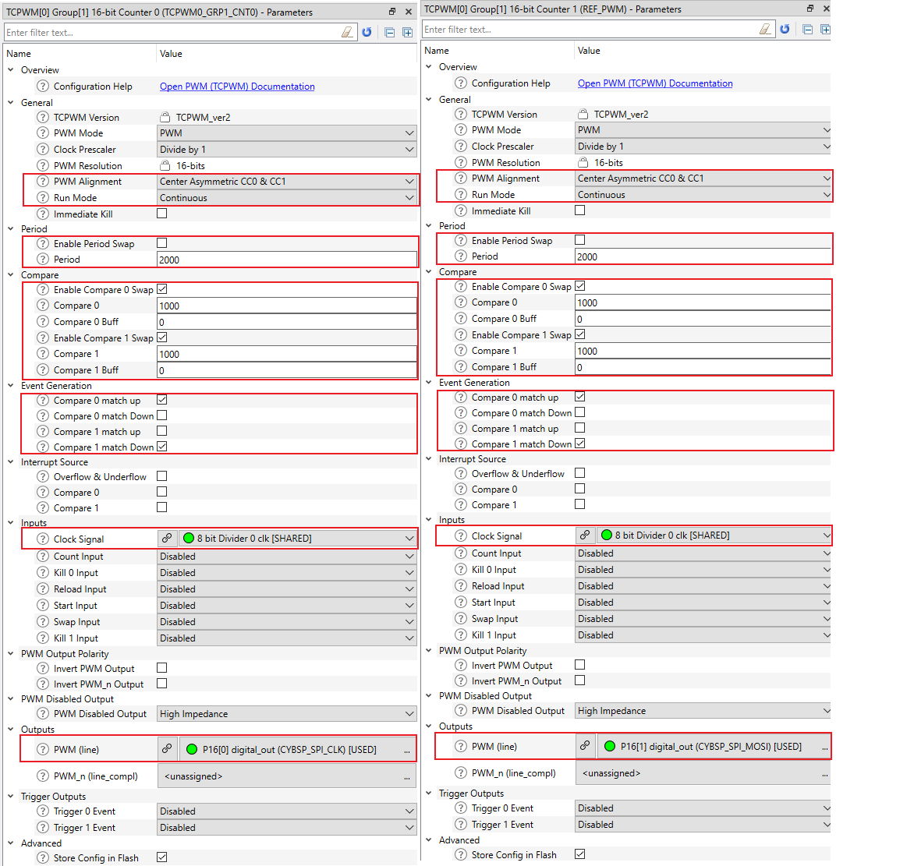

[Click here](../README.md) to view the README.

## Design and implementation

The design of this application is minimalistic to get started with code examples on PSOC&trade; Edge MCU devices. All PSOC&trade; Edge E84 MCU applications have a dual-CPU three-project structure to develop code for the CM33 and CM55 cores. The CM33 core has two separate projects for the secure processing environment (SPE) and non-secure processing environment (NSPE). A project folder consists of various subfolders, each denoting a specific aspect of the project. The three project folders are as follows:

**Table 1. Application projects**

Project | Description
--------|------------------------
*proj_cm33_s* | Project for CM33 secure processing environment (SPE)
*proj_cm33_ns* | Project for CM33 non-secure processing environment (NSPE)
*proj_cm55* | CM55 project

 

In this code example, at device reset, the secure boot process starts from the ROM boot with the secure enclave (SE) as the root of trust (RoT). From the secure enclave, the boot flow is passed on to the system CPU subsystem where the secure CM33 application starts. After all necessary secure configurations, the flow is passed on to the non-secure CM33 application. Resource initialization for this example is performed by this CM33 non-secure project. It configures the system clocks, pins, clock to peripheral connections, and other platform resources. It then enables the CM55 core using the `Cy_SysEnableCM55()` function and the CM55 core is subsequently put to DeepSleep mode.

This code example demonstrates generating asymmetric PWM signals using dual compare/capture. The configuration required for the TCPWM block is set in a custom *design.modus* file.

An asymmetric PWM signal is a center-aligned PWM shifted either to the left or right. In this mode, the counter counts up until its counter value reaches the period and then counts down until it becomes zero (repeats itself). The CC0 register value is used as a match while counting up while the CC1 register value is used while counting down. When the counter value matches the CC0 register value, the PWM signal goes HIGH and when the counter value matches the CC1 register value, the PWM signal goes LOW. Thus, by having different CC0 and CC1 register values, you can generate asymmetric PWM signals of any width and phase.

**Figure 1. TCPWM configurations in custom design file**

The Debug UART is used to accept commands from the terminal. A callback is generated upon every command received. The CC0_Buff and CC1_Buff register values are modified according to the command. A swap is then triggered to exchange CC and CC_Buff values.

The advantage of using dual compare/capture registers to generate asymmetric PWM signals is the reduction in CPU bandwidth usage. With only one CC register, the application must write new values to CC_Buff registers every half a cycle. With two CC registers, the application needs to write new values to CC_Buff registers only once every cycle, reducing the CPU bandwidth usage by half.

Asymmetric PWMs are widely used in field-oriented control to drive the gates of MOSFET bridges. The duty cycle of the PWM signals is modulated in the form of a sine wave to generate the required vectors. Asymmetric PWMs are used to introduce temporary phase shifts to measure single-shunt current. The single-shunt design reduces the cost and complexity of the motor control application significantly.
